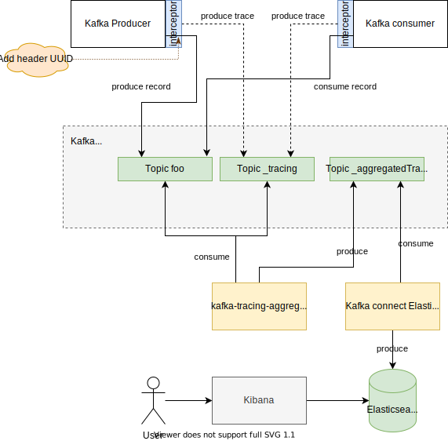

# kafka-tracing-interceptors


[](https://sonarcloud.io/dashboard?id=GuillaumeWaignier_kafka-tracing-interceptors)
[](https://search.maven.org/#search%7Cgav%7C1%7Cg%3A"org.ianitrix"%20AND%20a%3A"kafka-tracing-interceptors")

Kafka Interceptors used to trace messages produced and consumed.

Interceptors can be used in java producer/consumer, kafka connect and kafka stream applications.
All traces are kafka messages sent to the topic **\_tracing**.

# Architecture



All traces are kafka messages sent to the topic **\_tracing**.
The kstream [kafka-tracing-aggregator](https://github.com/GuillaumeWaignier/kafka-tracing-aggregator) enriches the traces and sends them in topic **\_aggregatedTrace**.
A kafka connect connect consume **\_aggregatedTrace** and insert document in Elasticsearch.
A kibana dashboard provide some visualization.


# Usage

Add the interceptor class in the kafka producer/consumer configuration:
> interceptor.classes=org.ianitrix.kafka.interceptors.ProducerTracingInterceptor
> or
> interceptor.classes=org.ianitrix.kafka.interceptors.ConsumerTracingInterceptor

By default, the kafka producer that sends traces uses the same configuration as the producer/consumer where the interceptors are attached.
These means, the bootstrap server, the compression, the security configuration will be reused.
If some of these configurations are not specified, default values are used (see the table below).
You can override this configuration by adding new properties prefixed with __ianitrix.interceptor.__


| Property key     |   Default Value          | Is retrieve from producer/consumer config |
| ---------------  | ------------------------:| ---------------------------------------   |
| key.serializer   |  StringSerializer.class  | no                                        |
| value.serializer |  StringSerializer.class  | no                                        |
| acks             |  all                     | no                                        |
| compression.type |  gzip                    | yes                                       |
| client.id        |  <client.id>_interceptor | yes                                       |
 


## Example in Java

Producer (use **ProducerConfig.INTERCEPTOR\_CLASSES\_CONFIG**):

````java
final Map<String, Object> config = new HashMap<>();

// Producer configuration
config.put(ProducerConfig.BOOTSTRAP_SERVERS_CONFIG, "localhost:9092");
config.put(ProducerConfig.ACKS_CONFIG, "all");
config.put(ProducerConfig.CLIENT_ID_CONFIG, "example");
config.put(ProducerConfig.COMPRESSION_TYPE_CONFIG, "zstd");
config.put(ProducerConfig.KEY_SERIALIZER_CLASS_CONFIG, StringSerializer.class);
config.put(ProducerConfig.VALUE_SERIALIZER_CLASS_CONFIG, StringSerializer.class);

// Add the interceptor
config.put(ProducerConfig.INTERCEPTOR_CLASSES_CONFIG, ProducerTracingInterceptor.class.getName());

// Change the bootstrap server
config.put("ianitrix.interceptor." + ProducerConfig.BOOTSTRAP_SERVERS_CONFIG, "kafkatrace:9092");

final KafkaProducer<String, String> producer = new KafkaProducer<>(config);
````

Consumer (use **ConsumerConfig.INTERCEPTOR\_CLASSES\_CONFIG**):

```java
final Map<String, Object> config = new HashMap<>();

// Consumer configuration
config.put(ConsumerConfig.BOOTSTRAP_SERVERS_CONFIG, "localhost:9092");
config.put(ConsumerConfig.ISOLATION_LEVEL_CONFIG, "read_committed");
config.put(ConsumerConfig.CLIENT_ID_CONFIG, "example");
config.put(ConsumerConfig.GROUP_ID_CONFIG, "myGroupId");
config.put(ConsumerConfig.AUTO_OFFSET_RESET_CONFIG, "earliest");
config.put(ConsumerConfig.KEY_DESERIALIZER_CLASS_CONFIG, StringDeserializer.class);
config.put(ConsumerConfig.VALUE_DESERIALIZER_CLASS_CONFIG, StringDeserializer.class);

// Add the interceptor
config.put(ConsumerConfig.INTERCEPTOR_CLASSES_CONFIG, ConsumerTracingInterceptor.class.getName());

// Change the bootstrap server and set the compression type
config.put("ianitrix.interceptor." + ConsumerConfig.BOOTSTRAP_SERVERS_CONFIG, "kafkatrace:9092");
config.put("ianitrix.interceptor." + ProducerConfig.COMPRESSION_TYPE_CONFIG, "zstd");

final KafkaConsumer<String, String> consumer = new KafkaConsumer<>(config);
```

## Example with configuration file

Producer:

````properties
...
interceptor.classes=org.ianitrix.kafka.interceptors.ProducerTracingInterceptor
ianitrix.interceptor.bootstrap.servers=kafkatrace:9092
ianitrix.interceptor.compression.type=zstd
````

Consumer:

````properties
...
interceptor.classes=org.ianitrix.kafka.interceptors.ConsumerTracingInterceptor
ianitrix.interceptor.bootstrap.servers=kafkatrace:9092
ianitrix.interceptor.compression.type=zstd
````


# Tracing

All traces are kafka messages sent to the topic **\_tracing**.

## Send

key:
````yaml
{ 
  "correlationId": "af8074bc-a042-46ef-8064-203fa26cd9b3"
}
````

value:

````yaml
{
  "id": "f84891ad-7729-4754-9a6d-f76754493260",
  "topic": "test",
  "correlationId": "af8074bc-a042-46ef-8064-203fa26cd9b3",
  "date": "2020-03-19T08:57:27.367553Z",
  "type": "SEND",
  "clientId": "myProducer"
}
````

## Ack

key:
````yaml
{
  "topic": "test",
  "partition": 0,
  "offset": 0
}
````

value:
````yaml
{
  "id": "hf4891ad-7729-4754-9a6d-f76124493260",
  "topic": "test",
  "partition": 0,
  "offset": 0,
  "date": "2020-03-19T08:57:35.833484Z",
  "type": "ACK",
  "clientId": "myProducer"
}
````

## Consume

key:
````yaml
{
  "topic": "test",
  "partition": 0,
  "offset": 0,
  "groupId": "myGroup"
}
````

value:
````yaml
{
  "id": "a4a891ad-7729-4754-9a6d-f76124493260",
  "topic": "test",
  "partition": 0,
  "offset": 0,
  "correlationId": "af8074bc-a042-46ef-8064-203fa26cd9b3",
  "date": "2020-03-19T08:57:38.834501Z",
  "type": "CONSUME",
  "clientId": "myConsumer",
  "groupId": "myGroup"
}
````

## Commit

key:
````yaml
{
  "topic": "test",
  "partition": 0,
  "offset": 33,
  "groupId": "myGroup"
}
````

value:
````yaml
{
  "id": "344891ad-7729-4754-9a6d-f76124493azf",
  "topic": "test",
  "partition": 0,
  "offset": 33,
  "date": "2020-03-19T08:57:43.801418Z",
  "type": "COMMIT",
  "clientId": "myConsumer",
  "groupId": "myGroup"
}
````


# Dashboard

The kafka stream application [kafka-tracing-aggregator](https://github.com/GuillaumeWaignier/kafka-tracing-aggregator) enriches the traces
and provide Kibana dashboard.

# Test

A docker-compose file provides a full environment with kafka and a simple producer/consumer.

````shell
cd src/test/resources
docker-compose up -d
````

Then open [http://localhost:8080/](http://localhost:8080/)

You can change the number of messages produce by second in the file *src/test/resources/.env*: (40msg/s)
````properties
THROUGHPUT=40
````
